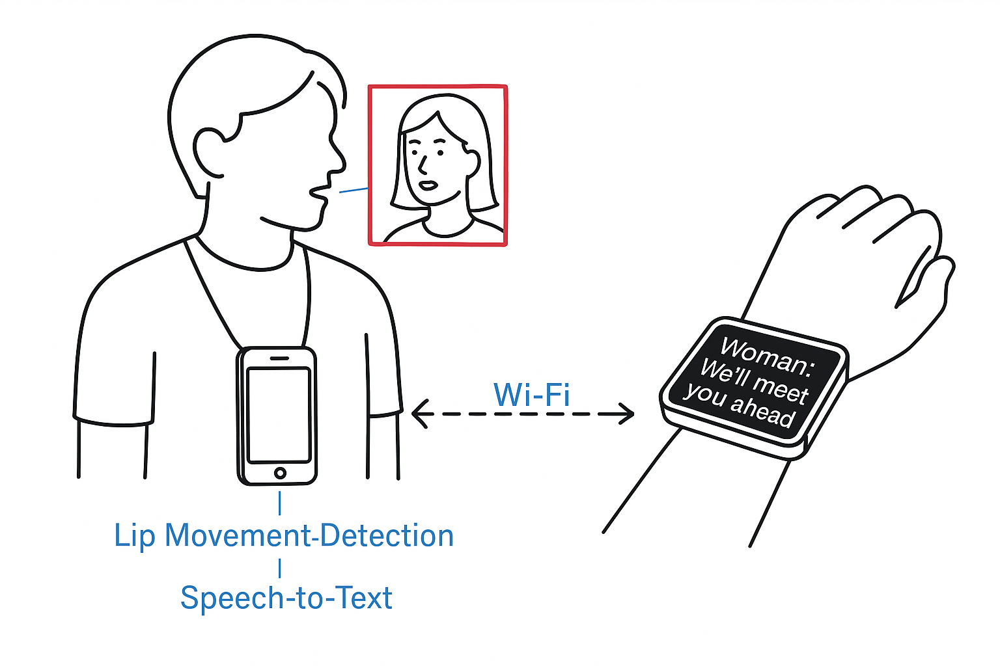
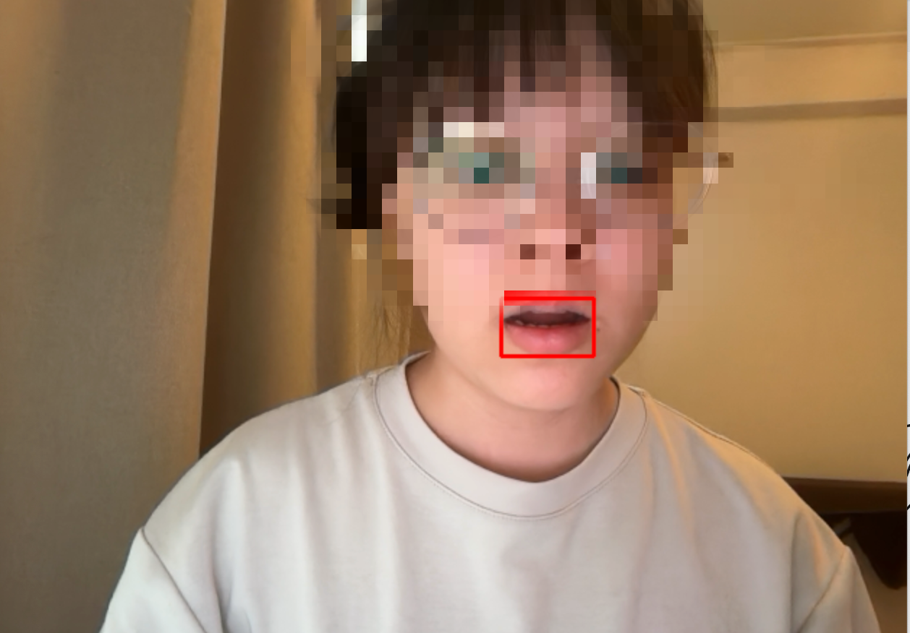

# 語音＋視覺辨識系統

### 問題說明

單一語音或視覺辨識皆有其限制：
- 語音辨識需聲援定位，往往仰賴多麥克風陣列來推估聲音來源與時差。
- 視覺辨識受限於解析度與演算法準確率。

## 解決方案：即時字幕生成系統

結合語音與視覺資訊，提升辨識正確率與即時性。


📷 ➜ [嘴唇辨識+追蹤] ➜ [選定說話者] ➜ 錄音 ➜ 語音辨識 ➜ 顯示字幕


## 各檔案與模型

| 檔案 | 任務 | 使用模型 |
|----------|------|----------|
| `mouth_tracker.py` | 即時偵測嘴唇區域，判斷是否說話 | OpenCV, MediaPipe | 
| `audio_recorder.py` | 同步錄音 | Argparse, sounddevice |
| `asr_engine.py` | 音訊轉為字幕 | Whisper
| `subtitle_overlay.py` |顯示字幕|OpenCV

## 本地執行

```bash
# 虛擬環境
python3 -m venv myenv
source myenv/bin/activate

# 安裝相依套件
pip install -r requirements.txt

# 執行主程式
python main.py
```

## .gitignore 範例

建議在專案根目錄中新增 `.gitignore` 檔案來排除不必要檔案被加入版本控制：

```gitignore
# Python
__pycache__/
*.pyc

# Virtual environment
myenv/

# Audio files
*.wav

# macOS system files
.DS_Store

# VS Code settings
.vscode/
```
